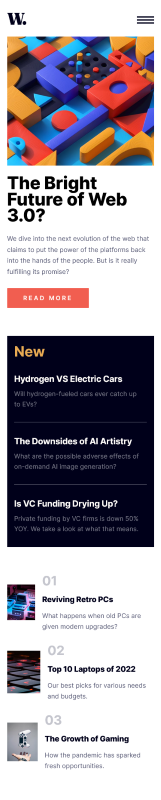
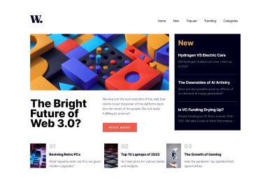

# Frontend Mentor - News homepage solution

This is a solution to the [News homepage challenge on Frontend Mentor](https://www.frontendmentor.io/challenges/news-homepage-H6SWTa1MFl).  

## Table of contents

- [Overview](#overview)
  - [The challenge](#the-challenge)
  - [Screenshot](#screenshot)
  - [Links](#links)
- [My process](#my-process)
  - [Built with](#built-with)
  - [What I learned](#what-i-learned)
  - [Continued development](#continued-development)
  - [Useful resources](#useful-resources)
- [Author](#author)
- [Acknowledgments](#acknowledgments)

## Overview

### The challenge

- See hover and focus states for all interactive elements on the page

### Screenshots

Add a screenshot of your solution. The easiest way to do this is to use Firefox to view your project, right-click the page and select "Take a Screenshot". You can choose either a full-height screenshot or a cropped one based on how long the page is. If it's very long, it might be best to crop it.

Then crop/optimize/edit your image however you like, add it to your project, and update the file path in the image above.

### Links

- Solution URL: [Add solution URL here](https://your-solution-url.com)
- Live Site URL: [Add live site URL here](https://your-live-site-url.com)

## My process

### Built with

- Semantic HTML5 markup
- CSS custom properties
- Flex
- CSS Grid
- Javascript
- Mobile-first workflow

### What I learned

The purpose of this challenge is to practice my skills.

### Useful resources

- [Flex](https://css-tricks.com/snippets/css/a-guide-to-flexbox/).
- [Grid](https://css-tricks.com/snippets/css/complete-guide-grid/).
- [MDN](https://developer.mozilla.org/en-US/).

## Author

- Website - [María Airala](https://stateofdev.com.ar/)
- Frontend Mentor - [@mardeva](https://www.frontendmentor.io/profile/mardeva)
- Twitter - [@stateofdev_BA](https://www.twitter.com/stateofdev_BA)

